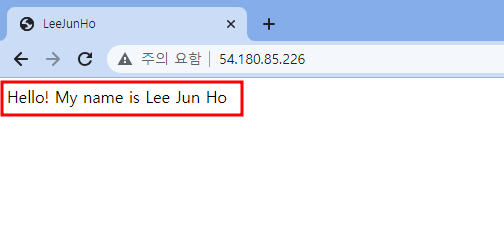
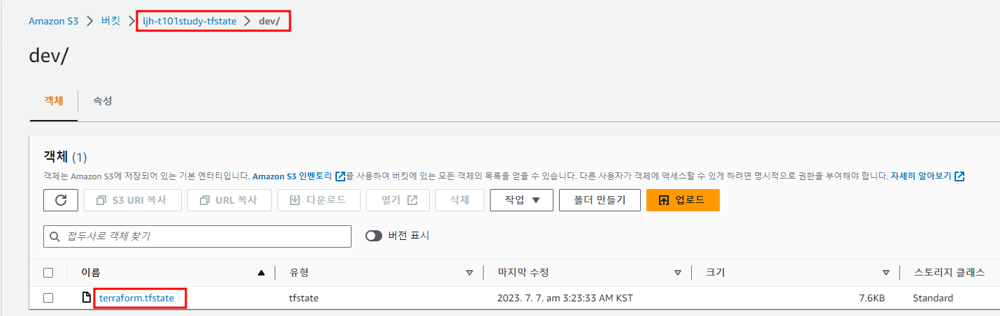

# 1주차 도전과제

## [도전과제1] - Challenge1

- Ubuntu 에 apache(httpd) 를 설치하고 index.html 생성(닉네임 출력)하는 userdata 를 작성해서 설정 배포 후 웹 접속

    1. apache 설치를 위한 스크립트 생성
        
        ```bash
        #!/bin/bash
        
        sudo apt -y update
        
        sudo apt install -y apache2
        
        sudo systemctl enable aapache2.service
        sudo systemctl start apache2.service
        
        sleep 15
        
        sudo tee /var/www/html/index.html <<EOF
        <html>
        <head>
        <meta http-equiv="Content-Type" content="text/html; charset=euc-kr" />
        <title> LeeJunHo </title>
        </head>
        
        <body>
        <p>Hello! My name is Lee Jun Ho</p>
        </body>
        </html>
        EOF
        
        sudo systemctl restart apache2.service
        
        ```
        
    2. data source를 통해 Ubuntu 20.04 최신 이미지 가져오기
        
        ```bash
        data "aws_ami" "latest_ubuntu_22_04" {
          most_recent = true # 최신 ami가져옴
          filter {
            name   = "name"
            values = ["ubuntu/images/hvm-ssd/ubuntu-jammy-22.04-amd64-server*"]
          }
          filter {
            name   = "virtualization-type"
            values = ["hvm"]
          }
          owners = ["099720109477"] # Canonical (우분투를 만든회사에 대해서만 ami가져옴)
        }
        ```
        
    3. user_data를 사용하여 AWS EC2 인스턴스를 생성 
        
        ```bash
        resource "aws_instance" "apache" {
          ami                         = data.aws_ami.latest_ubuntu_22_04.id
          instance_type               = "t2.micro"
          vpc_security_group_ids      = [aws_security_group.apache_sg.id]
        
          user_data = filebase64("${path.module}/setup_apache.sh")
        
          tags = { Name = "${var.name}-apache-instance" }
        }
        ```
        
    4. 웹 접속 확인
        
        
        <br>
        <br>

## [도전과제2] - Challenge2

- AWS S3/DynamoDB 백엔드 설정 실습
    1. 테라폼 코드를 통한 S3와 DynamoDB 생성
        
        ```bash
        # S3 생성
        resource "aws_s3_bucket" "s3_bucket" {
          bucket = "${var.name}-t101study-tfstate"
        }

        # 상태 파일의 전체 개정 내역을 볼 수 있도록 버전 관리를 활성화
        resource "aws_s3_bucket_versioning" "s3bucket_versioning" {
          bucket = aws_s3_bucket.s3_bucket.id
          versioning_configuration {
            status = "Enabled"
          }
        }
        
        # DynamoDB 생성
        resource "aws_dynamodb_table" "dynamodb_table" {
          name         = "terraform-locks"
          billing_mode = "PAY_PER_REQUEST"
          hash_key     = "LockID"

          attribute {
            name = "LockID"
            type = "S"
          }
        }
        
        ```
        
    2. 생성한 S3와 DynamoDB를 사용한 백엔드 설정
        
        ```bash
        terraform {
          backend "s3" {
            bucket = "ljh-t101study-tfstate"
            key    = "dev/terraform.tfstate"
            region = "ap-northeast-2"
            dynamodb_table = "terraform-locks"
            # encrypt        = true
          }
        }
        ```
        
    3. 설정한 backend로 terraform 실행 시 S3의 tfstate 파일 확인
        
        
        <br>
        <br>

## [도전과제3] - Challenge3

- lifecycle의 precondition 실습 내용에서 step0.txt ~ step6.txt 총 7개의 파일 이름 중 하나가 일치 시 검증 조건 만족으로 코드 작성 

    1. OR(||) 조건을 통해 file_name 변수값을 체크하여 step0.txt ~ step6.txt 파일 중 이름 일치시 조건 만족 코드 작성
        
        ```bash
        variable "file_name" {
          default = "step0.txt"
        }

        resource "local_file" "abc" {
          content  = "lifecycle - step 6"
          filename = "${path.module}/${var.file_name}"

          lifecycle {
            precondition {
              condition     = var.file_name == "step0.txt" || var.file_name == "step1.txt" || var.file_name == "step2.txt" || var.file_name == "step3.txt" || var.file_name == "step4.txt" || var.file_name == "step5.txt" || var.file_name == "step6.txt"
              error_message = "file name is not step0.txt to step6.txt"
            }
          }
        }
        
        ```
        
    2. list 요소 중 value값이 포함되는지 검사하는 contains 함수를 사용하여 file_name 변수값을 체크하여 step0.txt ~ step6.txt 파일 중 이름 일치시 조건 만족 코드 작성
    <br>
    <br>
    ex) contains 함수 예시
        ```bash
        > contains(["a", "b", "c"], "a")
        true
        > contains(["a", "b", "c"], "d")
        false
        ```
        <br>

        ```bash
        variable "file_name2" {
          default = "step0.txt"
        }

        variable "file_name_list" {
          type        = list(string)
          default     = ["step0.txt", "step1.txt", "step2.txt", "step3.txt", "step4.txt", "step5.txt", "step6.txt"]
        }


        resource "local_file" "def" {
          content  = "lifecycle-step 6"
          filename = "${path.module}/${var.file_name2}"

          lifecycle {
            precondition {
              condition      = contains(var.file_name_list, var.file_name2)
              error_message  = "file name is not step0.txt to step6.txt"
            }
          }
        }
        ```
        <br>

## [도전과제4] - Challenge4

- Hashicorp AWS Provider Document 에 Example Usage 중 아무거나 1개의 AWS 서비스 리소스 배포 실습 

    1. VPC, Subnet, InternetGW, Routing Table 생성
        
        ```bash
        provider "aws" {
          region  = "ap-northeast-2"
        }

        variable "name" {
          default = "ljh"
        }

        ###### VPC ######
        resource "aws_vpc" "vpc" {
          cidr_block           = "10.0.0.0/16"
          enable_dns_support   = true
          enable_dns_hostnames = true

          tags = {
            Name = "${var.name}-vpc"
          }
        }

        ###### Subnet ######
        resource "aws_subnet" "pub_subnet" {
          vpc_id     = aws_vpc.vpc.id
          cidr_block = "10.0.1.0/24"

          tags = {
            Name = "${var.name}-subnet"
          }
        }

        ###### Internet Gateway ######
        resource "aws_internet_gateway" "igw" {
          vpc_id = aws_vpc.vpc.id
          tags = {
            Name = "${var.name}-igw"
          }
        }

        ####### routing table ######
        resource "aws_route_table" "route_table_public" {
          vpc_id = aws_vpc.vpc.id
          tags   = { Name = "${var.name}-rt" }
        }

        resource "aws_route" "public_route" {
          route_table_id         = aws_route_table.route_table_public.id
          destination_cidr_block = "0.0.0.0/0"
          gateway_id             = aws_internet_gateway.igw.id
        }

        resource "aws_route_table_association" "public_asso_rt" {
          subnet_id      = aws_subnet.pub_subnet.id
          route_table_id = aws_route_table.route_table_public.id
        }

        ```